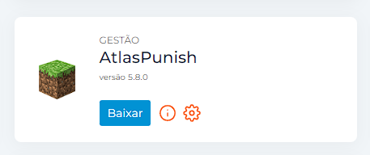

# Casos e exceções

## Plugins não compatíveis com o Launcher AtlasLicense

Alguns plugins por limitações da API da SpigotMC foram feitos sem a integração do AtlasLicense, isso significa que estes plugins devem ser utilizados normalmente como arquivos JAR.

## Como identificar os plugins não compatíveis?

Os plugins não compatíveis com o AtlasLicense possuirão um botão de "Baixar" o plugin no painel de controle do cliente como mostrado na imagem abaixo:

<figure><figcaption></figcaption></figure>
