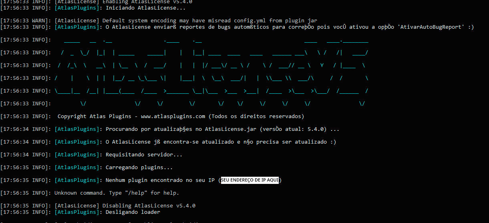
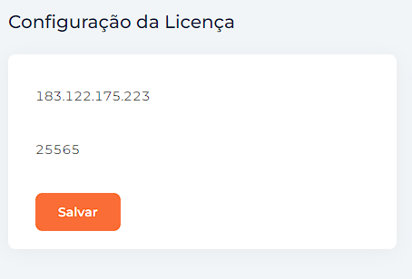
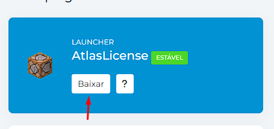
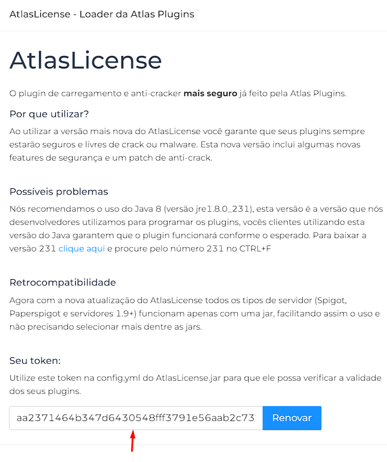
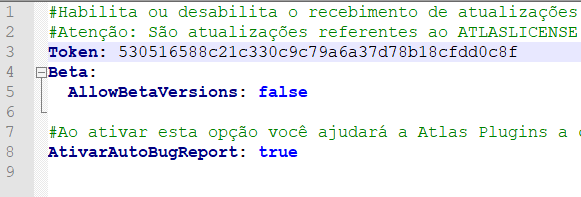

# O que é, e como utilizar?



## Como utilizar o AtlasLicense?

O AtlasLicense é um plugin em que utiliza um código inovador criado pela Atlas Plugins que junta todos os plugins comprados de uma conta da Atlas Plugins e os carrega automaticamente, sem precisar de se preocupar com baixar arquivos JAR e etc. A única coisa que você precisa fazer é baixar 1 arquivo jar chamado **AtlasLicense.jar** disponível no [painel de controle do cliente](https://atlasplugins.com/dashboard/plugins) e colocá-lo na pasta plugins do seu servidor Spigot.

##

<figure><figcaption>
Local para baixar o Launcher AtlasLicense
</figcaption></figure>

## Configurando o AtlasLicense com servidor Spigot

Após baixar o AtlasLicense.jar no site, você deverá colocá-lo na pasta plugins do seu servidor e fazer os seguintes passos abaixo:

* Inicie seu servidor (com whitelist de preferência)
* Aguarde a inicialização completa do servidor
* Finalize a execução do seu servidor com o comando (stop)

Após a finalização do servidor, você poderá visualizar uma mensagem parecida com esta:

<figure><figcaption></figcaption></figure>

O AtlasLicense inicialmente não reconhecerá o seu servidor pois você ainda não o configurou corretamente. Após a primeira inicialização o AtlasLicense irá mostrar o seu endereço de IP que sua máquina está utilizando (na print, por questões de segurança ocultei o endereço de IP porém o endereço de ip aparecerá onde está escrito "SEU ENDEREÇO DE IP AQUI"), copie este endereço de IP e vá até o [painel de controle do cliente](https://atlasplugins.com/dashboard/plugins) para escolher os plugins que você quer que o seu servidor inicie.

## Configurando os plugins para iniciar em seu servidor

Quando você entrar no painel de controle do cliente, selecione o plugin que você quer iniciar e clique na engrenagem ([⚙️](https://emojipedia.org/gear/)) como mostra a print abaixo do painel de controle e configure o endereço de IP copiado anteriormente no console do seu servidor no campo Informe o IP

<figure><figcaption></figcaption></figure>


Os endereços de IP possuem um formato padrão quando são mostrados no console do servidor que é o **IP:PORTA**


Cole o endereço de IP no campo "Informe o IP" e a porta no campo "Informe a porta" e clique em "Salvar". No exemplo a seguir, utilizamos o IP 183.122.175.223:25565 para demonstrar melhor como deve ser no painel de controle

<figure><figcaption></figcaption></figure>

## Configurando token de segurança

Após configurado o endereço de IP do seu servidor no painel de controle do cliente, é necessário fazer uma configuração a mais de segurança, para isso clique na opção "Baixar" no campo do AtlasLicense no painel de controle do cliente e copie o UUID (ID único do cliente) no campo "Seu token" no modal que aparecerá

<figure><figcaption></figcaption></figure>

<figure><figcaption></figcaption></figure>

Após copiar este token, abra a pasta plugins de seu servidor e vá até a pasta do AtlasLicense e acesse o arquivo config.yml e cole o token copiado anteriormente no campo "Token", conforme a print abaixo:

<figure><figcaption></figcaption></figure>

Após isso, salve o arquivo de configuração config.yml e inicie seu servidor novamente, o AtlasLicense reconhecerá automaticamente seus plugins comprados na loja e os carregarão em seu servidor.

## Possíveis problemas

Nós recomendamos o uso do Java 8 (versão jre1.8.0\_231), esta versão é a versão que nós desenvolvedores utilizamos para programar os plugins, vocês clientes utilizando esta versão do Java garantem que o plugin funcionará conforme o esperado. Para baixar a versão 231 [clique aqui](https://www.oracle.com/java/technologies/javase/javase8u211-later-archive-downloads.html) e procure pelo número 231 no CTRL+F
